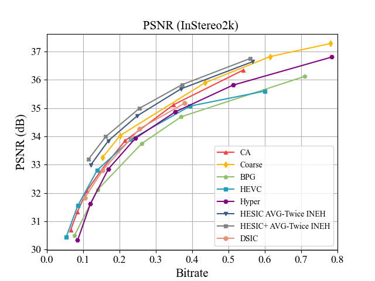

# CompressAI
[paper link](https://openaccess.thecvf.com/content/CVPR2021/papers/Deng_Deep_Homography_for_Efficient_Stereo_Image_Compression_CVPR_2021_paper.pdf)

HESIC Project is inherited from https://github.com/InterDigitalInc/CompressAI

Installation：

```
pip install -e . 
pip install opencv-contrib-python==3.4.2.17 
pip install kornia 
conda config --add channels https://mirrors.tuna.tsinghua.edu.cn/anaconda/pkgs/free/
conda config --add channels https://mirrors.tuna.tsinghua.edu.cn/anaconda/pkgs/main/
conda config --set show_channel_urls yes
conda config --add channels https://mirrors.tuna.tsinghua.edu.cn/anaconda/cloud/pytorch/
conda install pytorch==1.6.0 torchvision cudatoolkit=10.1
```


## test scripts:

cd /ywz/mywork/

```python test3real.py -d "/home/ywz/database/aftercut512"  --seed 0  --patch-size 512 512 --batch-size 1 --test-batch-size 1```

or

```python test3_savereal.py -d "/home/ywz/database/aftercut512"  --seed 0  --patch-size 512 512 --batch-size 1 --test-batch-size 1```


## Errata notes

Recently, when we pushed forward new work, we discovered that there was an error in the code, which led to the wrong results of the conference paper, and we made sufficient improvements and fine-tunings, and attached the final correct results.
The reason for the error: We are based on the training and test scripts of the example/train.py internship of the CompressAI framework, but in the [2020.7 version](https://github.com/InterDigitalInc/CompressAI/blob/c1cf1f79c6a0489902d937d711ca9ec36e234102/examples/train.py), CompressAI incorrectly used the 'val' variable in the package class of 'AverageMeter'. It was not checked due to the time of submission and our negligence. 

At the same time, we have completed the serialization part of the code, and used the left-eye decoded image to re-enter the left-eye code to guide the right-eye entropy model.

（If using the old models and change 'avg' to ['val'](https://github.com/ywz978020607/HESIC/blob/546e0c0788552caee4ac75a229558ff64f295916/ywz/mywork/test3.py), the wrong results in the paper could be achieved.）


Result.




## datasets:

Pan Baidu :

link：https://pan.baidu.com/s/1sSbMCl-6LXPal_asBt5Giw 
code：k8rb 

Google Drive: link: https://drive.google.com/drive/folders/1tTMs8vf7Z4FAjwCg2aQVGA_pc9O_VpS1?usp=sharing


## pretrained_models:
old models:

Pan Baidu :

link：https://pan.baidu.com/s/1q0_2NZ46fYOCeDDg40nUaw 
code：qrfu 

Google Drive: link: https://drive.google.com/drive/folders/1tTMs8vf7Z4FAjwCg2aQVGA_pc9O_VpS1?usp=sharing

new models:
we have put the new models now.
link: https://bhpan.buaa.edu.cn:443/link/2DFC695B03950A85EF137D8D0FEB62CD
有效期限：2023-04-01 23:59


## Serialize

cd ywz/mywork

`newnet1.py` : HESIC 

`newnet1_joint.py` : HESIC+

`test2_codec.py` : test script for codec-compress & decompress  

​	-- import newnet1 or import newnet1_joint


cd ywz/DSIC

`mynet6_plus.py`: DSIC with codec

`mytrain2_test_codec.py`: test script for codec in DSIC


## Migration on Mindspore
https://github.com/ywz978020607/2021Summer-Image-Compression
